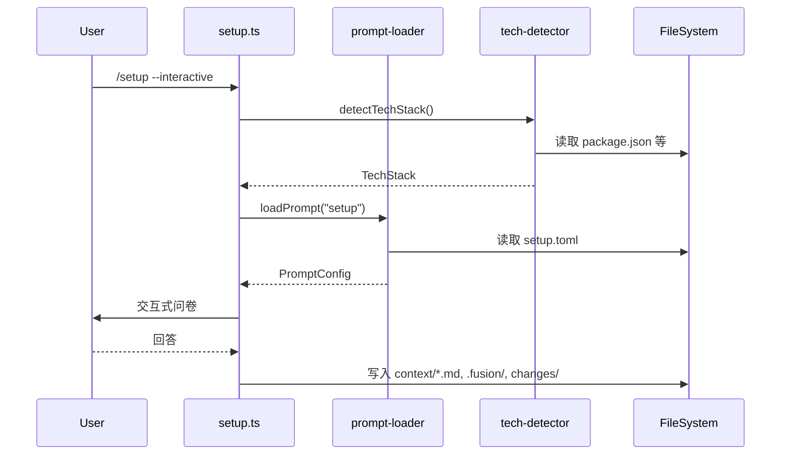

# 设计文档 (Design Document)

## 架构概述 (Architecture Overview)

```
conductor/commands/*.toml  ─────────────┐
                                        ▼
┌──────────────────────────────────────────────────────────────────┐
│                    superpowers-fusion                            │
├──────────────────────────────────────────────────────────────────┤
│  prompts/conductor/          │  lib/                             │
│    setup.toml                │    prompt-loader.ts  ◄─ 解析 TOML │
│    implement.toml            │    tech-detector.ts  ◄─ 检测逻辑  │
│    status.toml               │    task-status-tracker.ts         │
├──────────────────────────────────────────────────────────────────┤
│  commands/                                                       │
│    setup.ts      ─► 调用 prompt-loader + tech-detector          │
│    status.ts     ─► 调用 task-status-tracker                    │
│    implement.ts  ─► 调用 executing-plans skill                  │
└──────────────────────────────────────────────────────────────────┘
```

## 模块设计 (Module Design)

### 1. `lib/prompt-loader.ts`
- 加载 TOML 文件并解析为内存模型
- 提供 `loadPrompt(commandName: string): PromptConfig` 接口
- 支持热更新（可选）

### 2. `lib/tech-detector.ts`
- 实现技术栈自动检测
- 检查 `package.json`, `tsconfig.json`, `vite.config.*`, `next.config.*` 等
- 返回结构化 `TechStack` 对象

### 3. 增强 `commands/setup.ts`
- 添加 `--interactive` 标志
- 调用 `tech-detector` 进行自动检测
- 调用 `prompt-loader` 获取问卷提示词
- 创建 `.fusion/` 和 `changes/` 目录

### 4. 新建 `commands/status.ts`
- 读取 `.fusion/status.json`
- 统计任务完成度
- 格式化输出进度报告

### 5. 新建 `commands/implement.ts`
- 列出可用的 changes
- 让用户选择目标
- 调用 `executing-plans` skill

## 数据流 (Data Flow)



## 风险与缓解 (Risks & Mitigation)

| 风险 | 缓解措施 |
|------|----------|
| TOML 与 TS 行为偏差 | 建立黄金样例项目，对比输出 |
| 提示词回归 | 添加 dry-run 模式输出 prompt 供审阅 |
| 交互复杂度 | 分步可跳过，提供默认值/自动检测结果 |
| 状态一致性 | 幂等写入，错误时不损坏现有状态文件 |
