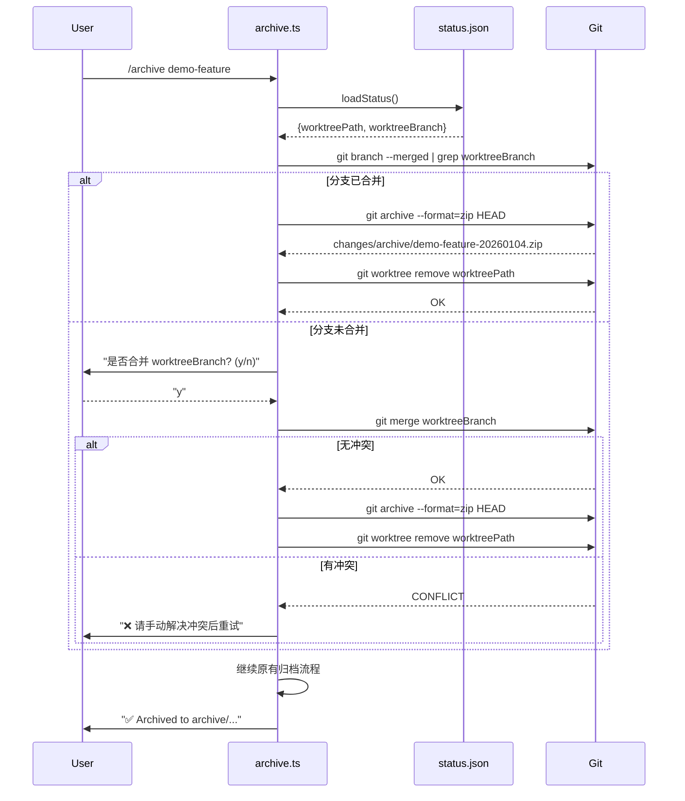

# Design: Reactivate Advanced Skills

## 项目路径参考

| 项目 | 名称 | 路径 |
|------|------|------|
| **原版** | `superpowers` | `C:\github\merage surperpower\superpowers` |
| **目标** | `superpowers-fusion` | `C:\github\merage surperpower\superpowers-fusion` |

---

## Overview

本设计文档描述如何将 `using-git-worktrees` 和 `dispatching-parallel-agents` 技能程序化地集成到 Fusion 工作流中，重点说明 Archive 命令的合并保障和 Git 存档机制。

---

## Architecture Decision Records

### ADR-1: 合并+Git存档+清理逻辑放在 Archive 命令中

**Context**: 需决定 worktree 分支的合并、Git 存档和清理在哪个命令中执行。

**Options**:
1. 在 `implement` 任务完成时提示合并。
2. 在 `archive` 命令中自动合并 + Git 存档（提案选择）。
3. 单独 `finish` 命令。

**Decision**: **Option 2 (Archive 命令)**

**Rationale**:
- 归档是工作流的"终点"，此时合并最自然。
- Git 存档 (`git archive`) 在合并后立即执行，保留完整代码快照。
- 用户可能多次运行 `implement`（增量完成任务），不应每次都提示合并。
- 确保分支合并后才能归档，防止孤立分支。

---

### ADR-2: Git 存档格式和位置

**Context**: 合并后如何创建本地代码存档。

**Decision**: 使用 `git archive --format=zip`

**Implementation**:
```bash
git archive --format=zip HEAD -o changes/archive/<change-name>-<timestamp>.zip
```

**Rationale**:
- `git archive` 创建干净的代码包（不含 .git 目录）。
- Zip 格式跨平台兼容。
- 存档与变更目录一起归档，便于追溯。
- 通过 `--no-zip` 标志可跳过此步骤。

---

### ADR-3: Worktree 默认开启

**Context**: Worktree 隔离是否应为默认行为。

**Decision**: **默认开启**，可通过 `--no-worktree` 关闭。

**Rationale**:
- 隔离是安全默认值（防止污染主分支）。
- 高级用户可选择关闭以节省磁盘空间。
- 符合原版设计意图（brainstorming Phase 4 强制使用）。

---

## Sequence Diagram: Archive with Worktree + Git Archive



---

## Data Schemas

### `.fusion/status.json` (Extended)

```json
{
  "changeName": "demo-feature",
  "startedAt": "2026-01-04T10:00:00Z",
  "worktreePath": ".worktrees/demo-feature",
  "worktreeBranch": "feature/demo-feature",
  "tasks": {
    "1.1": { "status": "complete", "sha": "abc123" },
    "1.2": { "status": "pending" }
  }
}
```

### Git Archive Output

```
changes/
└── archive/
    ├── demo-feature-20260104-103045.zip  ← Git 存档
    └── 2026-01-04-demo-feature/           ← 变更目录
        ├── proposal.md
        ├── tasks.md
        └── metadata.json
```

---

## Error Handling

| 场景 | 行为 |
|------|------|
| Worktree 存在但分支已删除 | 警告并跳过合并，仅清理目录 |
| 合并冲突 | 暂停归档，提示手动解决 |
| Git archive 失败 | 警告但继续归档（非阻塞） |
| Worktree 目录不存在但 status 有记录 | 清理 status 中的字段，继续归档 |
| 并发 Agent 同时尝试归档 | 第一个成功，后续报错"change not found" |

---

## CLI Interface

```bash
# 完整命令
/archive <change-name> [--yes] [--tag] [--checkpoint] [--no-merge] [--no-zip]

# 标志说明
--yes         跳过所有确认提示
--tag         创建 Git tag
--checkpoint  创建 checkpoint commit
--no-merge    不自动合并，仅检查（未合并则报错）
--no-zip      不创建 Git 存档
```
