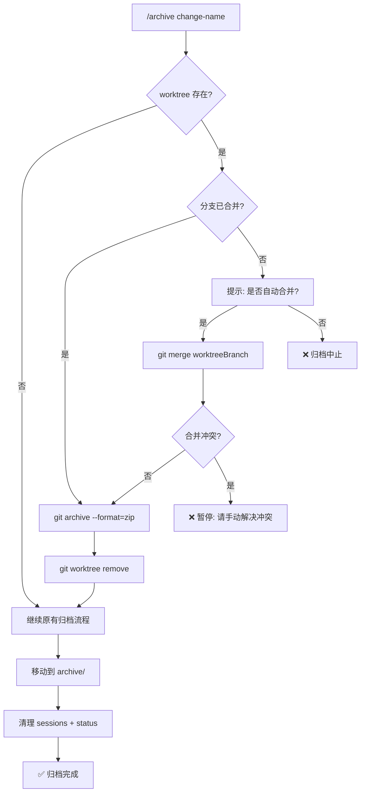

# Change: reactivate-advanced-skills

> 将 `using-git-worktrees` 和 `dispatching-parallel-agents` 技能重新集成到 Fusion 自动化工作流中，保持原版功能并增量扩展。

---

## 0. 项目路径参考 (Project Paths)

> [!IMPORTANT]
> 本提案涉及两个项目的对比和迁移，请确保使用正确的路径。

| 项目 | 名称 | 本地路径 |
|------|------|----------|
| **原版 (Original)** | `superpowers` | `C:\github\merage surperpower\superpowers` |
| **目标 (Fusion)** | `superpowers-fusion` | `C:\github\merage surperpower\superpowers-fusion` |

### 关键技能文件对照

| 技能 | 原版路径 | Fusion 路径 |
|------|----------|-------------|
| `using-git-worktrees` | `superpowers/skills/using-git-worktrees/SKILL.md` | `superpowers-fusion/skills/using-git-worktrees/SKILL.md` |
| `dispatching-parallel-agents` | `superpowers/skills/dispatching-parallel-agents/SKILL.md` | `superpowers-fusion/skills/dispatching-parallel-agents/SKILL.md` |
| `subagent-driven-development` | `superpowers/skills/subagent-driven-development/` (4 文件) | `superpowers-fusion/skills/subagent-driven-development/` (仅 SKILL.md) |

---

## 1. Background Context (完整上下文)

### 1.1 项目概述

`superpowers-fusion` 是多个 AI 编码扩展项目的合并版本：

- **obra/superpowers**: 技能驱动的 Prompt 系统，通过 `SKILL.md` 文件教育 Agent 行为。
- **nizos/tdd-guard**: 程序化 TDD 强制执行，通过 Hooks 拦截非测试驱动的代码修改。
- **Fission-AI/OpenSpec**: 规格驱动开发，支持变更归档和回溯。
- **gemini-cli-extensions/conductor**: 上下文管理和可追溯回退。

### 1.2 问题陈述

两个原版 Superpowers 技能在 Fusion 中处于"孤立"状态：

1. **`using-git-worktrees`**: 为功能开发创建 Git 工作树隔离。
2. **`dispatching-parallel-agents`**: 并发调试多个独立测试失败。

它们存在为 Markdown 文件，但 **没有脚本入口调用它们**。Fusion 的 `implement.ts` 是串行单目录模式。

### 1.3 原版 Superpowers 设计详解

> 源自: `C:\github\merage surperpower\superpowers`

#### `using-git-worktrees` (原版 superpowers)

- **文件**: `superpowers/skills/using-git-worktrees/SKILL.md` (218 行)
- **目的**: 为功能开发创建物理隔离的工作目录。
- **调用者**: `brainstorming` (Phase 4，设计批准后)。
- **配对者**: `executing-plans` 或 `subagent-driven-development`。
- **清理**: `finishing-a-development-branch` 在合并后移除 worktree。

#### `dispatching-parallel-agents` (原版 superpowers)

- **文件**: `superpowers/skills/dispatching-parallel-agents/SKILL.md` (181 行)
- **目的**: **调试** 多个无关的测试失败。
- **模式**: 手动打开多个 Claude 窗口，每个修复一个子系统。

### 1.4 Fusion 当前状态

> 目标: `C:\github\merage surperpower\superpowers-fusion`

| 文件 | Fusion 状态 |
|------|-------------|
| `skills/using-git-worktrees/SKILL.md` | 113 行 (原版 218 行的简化版) |
| `skills/dispatching-parallel-agents/SKILL.md` | 91 行 (原版 181 行的简化版) |
| `commands/implement.ts` | 串行单目录，无 worktree 支持 |
| `commands/archive.ts` | 无 worktree 感知，无 Git 存档 |

---

## 2. What Changes (具体变更)

### 用户确认的决策

- [X] **Worktree**: 默认开启。
- [X] **合并+清理**: 自动集成到 `/archive` 命令中。
- [X] **Git 存档**: 合并后创建本地 Git 存档。
- [X] **并发调度**: 程序化实现 (Fusion 扩展)。
- [X] **Subagent 模板**: 跳过 (Fusion 用 Hook + Codex 替代)。

---

## 3. Archive 命令扩展: 自动合并 + Git 存档 + 清理

### 3.1 当前 `/archive` 步骤 (现状)

```
1. 检查 change 是否存在
2. 检查 tasks.md 未完成任务
3. (可选) 分析 context 文档更新
4. (可选) 创建 checkpoint commit
5. 移动目录到 archive/
6. (可选) 创建 Git tag
7. 清理 Codex sessions
8. 重置 status.json
```

### 3.2 扩展后的 `/archive` 步骤 (提案)

```
1. 检查 change 是否存在
2. 检查 tasks.md 未完成任务
3. ★ 新增: 检查 worktree 状态
   ├── 读取 .fusion/status.json 中的 worktreePath 和 worktreeBranch
   ├── 如果存在 worktree:
   │   ├── 3a. 检查分支是否已合并 (git branch --merged)
   │   ├── 3b. 如果未合并:
   │   │   ├── 提示用户确认自动合并
   │   │   ├── 执行: git merge <worktreeBranch>
   │   │   └── 如果合并冲突 → 暂停并提示手动解决
   │   ├── 3c. 合并成功后:
   │   │   ├── ★ 执行: git archive --format=zip HEAD -o changes/archive/<name>.zip
   │   │   ├── 执行: git worktree remove <worktreePath>
   │   │   └── 清理 status.json 中的 worktree 字段
   │   └── 3d. 如果已合并:
   │       └── 直接执行 Git 存档和清理 (同 3c)
   └── 如果无 worktree → 跳过此步骤
4. (可选) 分析 context 文档更新
5. (可选) 创建 checkpoint commit
6. 移动目录到 archive/
7. (可选) 创建 Git tag
8. 清理 Codex sessions
9. 重置 status.json
```

### 3.3 Git 存档详解

在 worktree 合并成功后，立即创建 Git 存档：

```bash
# 创建压缩存档
git archive --format=zip HEAD -o changes/archive/<change-name>-<timestamp>.zip

# 或 tar.gz 格式
git archive --format=tar.gz HEAD -o changes/archive/<change-name>-<timestamp>.tar.gz
```

**存档命名规则**: `<change-name>-YYYYMMDD-HHMMSS.zip`

### 3.4 流程图



### 3.5 CLI 接口变更

```bash
# 原有
/archive <change-name> [--yes] [--tag] [--checkpoint]

# 新增标志
/archive <change-name> [--yes] [--tag] [--checkpoint] [--no-merge] [--no-zip]

# --no-merge: 跳过自动合并，仅检查 (如果未合并则报错)
# --no-zip: 跳过 Git 存档创建
```

### 3.6 代码变更位置

修改文件: `superpowers-fusion/commands/archive.ts`

```typescript
// 新增步骤 3: Worktree 检查、合并、Git 存档
async function handleWorktreeBeforeArchive(
    status: StatusData,
    options: ArchiveOptions
): Promise<{ success: boolean; error?: string; archiveZip?: string }> {
    if (!status.worktreePath || !status.worktreeBranch) {
        return { success: true }; // 无 worktree，跳过
    }

    // 检查分支是否已合并
    const isMerged = checkBranchMerged(status.worktreeBranch);
  
    if (!isMerged) {
        if (options.noMerge) {
            return { 
                success: false, 
                error: `Worktree branch "${status.worktreeBranch}" not merged.` 
            };
        }
      
        // 提示自动合并
        const shouldMerge = options.yes || await promptYesNo(
            `Worktree branch "${status.worktreeBranch}" not merged. Merge now? (y/n): `
        );
      
        if (!shouldMerge) {
            return { success: false, error: "Archive cancelled: worktree not merged." };
        }
      
        // 执行合并
        try {
            execSync(`git merge ${status.worktreeBranch}`, { stdio: "inherit" });
        } catch {
            return { 
                success: false, 
                error: "Merge conflict detected. Please resolve manually and retry." 
            };
        }
    }
  
    // ★ 创建 Git 存档
    let archiveZip: string | undefined;
    if (!options.noZip) {
        const timestamp = new Date().toISOString().replace(/[:-]/g, "").slice(0, 15);
        const zipName = `${status.changeName}-${timestamp}.zip`;
        const zipPath = path.join("changes", "archive", zipName);
        try {
            execSync(`git archive --format=zip HEAD -o ${zipPath}`, { stdio: "pipe" });
            console.log(`[Archive] Created Git archive: ${zipPath}`);
            archiveZip = zipPath;
        } catch {
            console.warn(`[Archive] Warning: Failed to create Git archive.`);
        }
    }
  
    // 清理 worktree
    try {
        execSync(`git worktree remove ${status.worktreePath}`, { stdio: "pipe" });
        console.log(`[Archive] Removed worktree: ${status.worktreePath}`);
    } catch {
        console.warn(`[Archive] Warning: Failed to remove worktree.`);
    }
  
    return { success: true, archiveZip };
}
```

---

## 4. Phase 1: 内容同步

### 4.1 文件对比与合并

| 技能 | 原版路径 | 原版行数 | Fusion 行数 | 操作 |
|------|----------|----------|-------------|------|
| `using-git-worktrees` | `superpowers/skills/using-git-worktrees/SKILL.md` | 218 | 113 | 增量合并 |
| `dispatching-parallel-agents` | `superpowers/skills/dispatching-parallel-agents/SKILL.md` | 181 | 91 | 增量合并 |

### 4.2 操作步骤

```bash
# 对比原版和 Fusion
diff "C:\github\merage surperpower\superpowers\skills\using-git-worktrees\SKILL.md" \
     "C:\github\merage surperpower\superpowers-fusion\skills\using-git-worktrees\SKILL.md"

# 增量合并 (保留 Fusion 的 Codex 扩展)
```

---

## 5. Phase 2: Worktree 程序化集成

修改 `superpowers-fusion/commands/implement.ts`:
- 默认启用 worktree (可用 `--no-worktree` 关闭)。
- 在 `.fusion/status.json` 中记录 `worktreePath` 和 `worktreeBranch`。

---

## 6. Phase 3: 并发调度集成

创建 `superpowers-fusion/commands/dispatch.ts`:
- 解析 `tasks.md` 中的 `<!-- parallel: groupId -->` 标记。
- 每个并发 Agent 在独立 worktree 工作。
- 文件锁 `.fusion/locks/` 防止任务抢占。

---

## 7. Impact (影响)

- **Affected code**:
  - MODIFY: `superpowers-fusion/commands/archive.ts` (新增步骤 3)
  - MODIFY: `superpowers-fusion/commands/implement.ts`
  - NEW: `superpowers-fusion/lib/worktree-manager.ts`
  - NEW: `superpowers-fusion/lib/parallel-dispatcher.ts`
  - NEW: `superpowers-fusion/commands/dispatch.ts`
- **Risk level**: Medium-High

---

## 8. Verification Plan

### 8.1 端到端测试

```bash
# 在 superpowers-fusion 目录下执行
cd "C:\github\merage surperpower\superpowers-fusion"

npm run new-change -- test-worktree
npm run implement -- test-worktree
# ... 完成任务 ...
npm run archive -- test-worktree
# → 验证: 自动合并 + Git 存档 (.zip) + worktree 清理 + 归档成功
```
