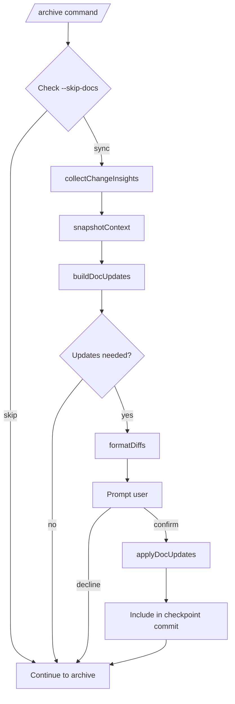

# Design: sync-context-docs

## Overview

This document describes the architecture for automatically synchronizing project context documents when archiving a completed change.

## Architecture



## Module Design

### `lib/doc-sync.ts`

```typescript
interface DocSyncOptions {
  changeDir: string;      // Path to change directory
  contextDir: string;     // Path to context directory  
}

interface DocUpdate {
  targetFile: string;
  reason: string;
  originalContent: string;
  updatedContent: string;
}

// Core function - uses LLM to analyze and generate updates
async function syncContextDocs(options: DocSyncOptions): Promise<DocUpdate[]>;

// Helper to format diffs for display
function formatDiffs(updates: DocUpdate[]): string;

// Apply updates to files
function applyDocUpdates(updates: DocUpdate[]): void;
```

### LLM Integration

Uses existing `lib/api-client.ts` to call the configured AI provider:

```typescript
import { createApiClient } from "./api-client.js";

const prompt = `Analyze the following change proposal and context documents.
Generate updates to context documents where needed.

## Change Proposal
${proposalContent}

## Current Context Documents
${contextContent}

Return JSON with updates needed for each file.`;

const client = createApiClient();
const response = await client.analyze(prompt);
```

## Edge Cases

1. **Malformed proposal**: Fall back to `rawProposal` and skip structured extraction
2. **Custom context format**: Warn user and skip file if expected sections not found
3. **No updates needed**: Log and continue without prompting
4. **User declines all updates**: Continue archive without changes
5. **Partial confirmation**: Not supported in v1 (all-or-nothing per file)

## Future Enhancements

- LLM-assisted analysis for semantic matching (requires API key)
- Partial update confirmation (per-section granularity)
- Dry-run mode for CI/CD integration
