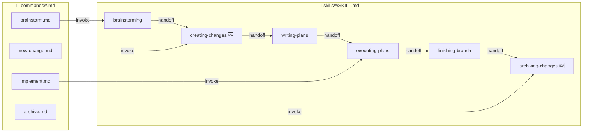
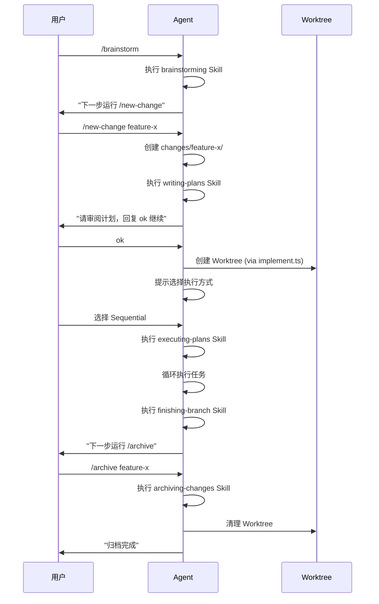

# Design: Unify Skill Workflow Chain

## 架构概览



## 关键流程

### 完整工作流程 (用户视角)



## Skill 链式调用规范

### 末尾 Handoff 模板

每个 Skill 末尾必须包含：

```markdown
## 下一步

**REQUIRED:** 调用 `superpowers:<next-skill-name>`

或者运行命令：
```
/<command-name> [args]
```
```

### 阻止 Agent 跳过步骤的机制

| 机制 | 使用场景 | 示例 |
|------|----------|------|
| `disable-model-invocation: true` | Command frontmatter | 阻止 Agent 自动触发命令 |
| `**REQUIRED SUB-SKILL:**` | Skill 中强制调用 | `Use superpowers:using-git-worktrees` |
| 用户确认阻断 | 需要人工审阅时 | `⚠️ 必须等待用户确认后才继续` |

## 新建 Skills 设计

### creating-changes

- **触发**: brainstorming 完成后
- **职责**: 反向引用 `/new-change` 命令，提供创建变更的上下文
- **输出**: handoff 到 `writing-plans`

### archiving-changes

- **触发**: finishing-branch 完成后
- **职责**: 反向引用 `/archive` 命令，说明归档流程
- **输出**: 结束点，提示可开始新变更

## 修改范围

| 文件 | 修改类型 | 关键变更 |
|------|----------|----------|
| `skills/writing-plans/SKILL.md` | MODIFY | 增加用户审阅阻断、Worktree 调用、执行方式选择 |
| `skills/executing-plans/SKILL.md` | MODIFY | 增加 Step 0 环境确认、末尾 finish/archive 引导 |
| `skills/finishing-a-development-branch/SKILL.md` | VERIFY | 确认 Step 5 Worktree 清理存在 |
| `skills/creating-changes/SKILL.md` | NEW | 创建变更的 Skill 封装 |
| `skills/archiving-changes/SKILL.md` | NEW | 归档变更的 Skill 封装 |
| `commands/implement.md` | MODIFY | 精简为 ~15 行，删除与 Skill 重复内容 |
| 各 Skills/Commands 末尾 | MODIFY | 添加统一 handoff 模式 |
